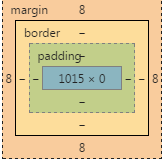
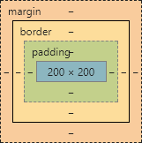
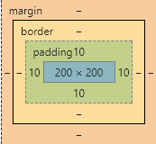
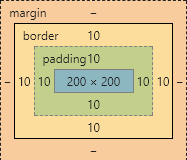
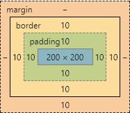

# 盒模型

**定义**
简单地说每个html标签都是一个方块，然后这个方块又包着几个小方块。分别是：margin、border、padding、content。它们的关系是margin包着border包着padding包着content。就像盒子一层一层地包着一样，这就是我们所说的盒模型。

*******************

盒子模型分为两类：W3C标准盒子模型和IE盒子模型

这两者的关键差别就在于：
   * W3C盒子模型——属性高（height）和属性宽（width）这两个值不包含 填充（padding）和边框（border）
   * IE盒子模型——属性高（height）和属性宽（width）这两个值包含 填充（padding）和边框（border）

各浏览器盒模型的组成结构是一致的，区别只是在"怪异模式"下宽度和高度的计算方式，而“标准模式”下则没有区别。

组成结构以宽度为例：totalwidth=marginLeft+borderLeft+paddingLeft+contentWidth+paddingRight+borderRight+marginRight（W3C标准盒子模型）。页面在“怪异模式”下，css中为元素的width和height设置的值在标准浏览器和ie系列(ie9除外)里的代表的含义是不同的（IE盒子模型）。

**************
## 盒子的宽高

1、查看[示例](./testbox.html)  content

对应的盒子模型：很明显这个时候的盒子大小就是content的大小

2、查看[示例](./testbox1.html)  content+padding 

对应的盒子模型：padding是能够改变盒子的大小的，这时盒子大小就等于content+padding。

3、查看[示例](./testbox2.html)  content+padding+border

对应的盒子模型：可以发现长宽变为了240x240，所以这时盒子大小就等于content+padding+border。

4、查看[示例](./testbox3.html)

对应的盒子模型：

很明显盒子的大小并没有变大，还是原来的240x240。

所以，最终盒子的大小为content+padding+border即内容的(width)+内边距的再加上边框，而不加上margin。

总结：在ie8+浏览器中使用哪个盒模型可以由box-sizing控制，默认值为content-box，即标准盒模型；如果将box-sizing设为border-box则用的是怪异盒模型。如果在ie6,7,8中DOCTYPE缺失会触发怪异模式。

我们可以把上面的红色方块的box-sizing设为border-box发现，无论我们怎么改border和padding盒子大小始终是定义的width和height：