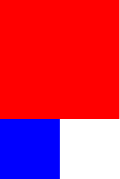
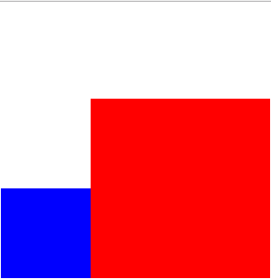
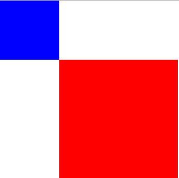
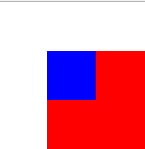
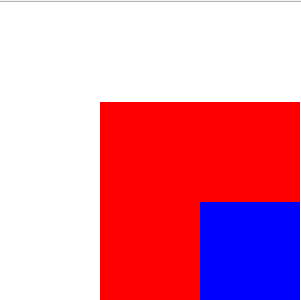
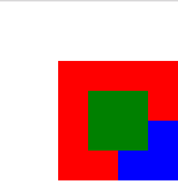
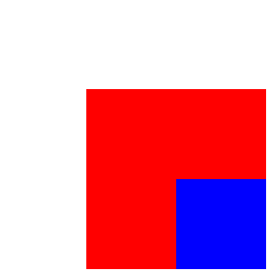

# 定位

定位(position)有四个值：

1 static
2 relative
3 absolute
4 fixed
*****************************

## static

一般如果我们不设置position的话它的默认值就是static，这个时候left、top、bottom、right、 z-index 是不起作用的，现在有如下两个div，他们的关系是兄弟关系：

查看[示例](./testposition.html)


## relative

现在我们给红色方块加个position:relative;

查看[示例](./testposition1.html)


可以发现，红色方块跑到蓝色方块的右边了，左边缘和顶边缘都距离原来100px，但是蓝色方块还是在原来的地方不动，现在可以得出一个结论：使用相对定位给元素加left/top/right/buttom元素会以原来的位置为基础加上这些值，即以原来的位置为基础定位，并且没有脱离文档流


## absolute
现在，我们把position改为absolute：

查看[示例](./testposition2.html)


可以发现蓝色方块如我们所愿移动到了红色方块的上面，说明红色方块已经脱离文档流。虽然红色方块的位移和relative一样但是，红色方块位移的参考不再是原来的位置而是body只不过红色方块的位置刚好在body的最左上角，刚好碰巧位移一样，上面的这个例子可能看不出来，让我们来改改代码。

首先将html结构改成：
```html
<div class="red">
    <div class="blue"></div>
</div>
```
然后红色方块的absolute改回relative

效果图：


然后蓝色方块代码改为：

```css
.blue{
    position:absolute;
    top:100px;
    left:100px;
    width:100px;
    height:100px;
    background-color:blue;
}
```
效果图：


可以发现在给蓝色方块添加position:absolute前，蓝色方块像我们想的那样在红色方块的左上角；当我们给蓝色方块添加position:absolute并且添加left和top时，蓝色方块就跑到了红色方块的右下角。

那么这次这个蓝色方块是以谁为参考进行位移的？刚刚你说的以body为参考又是什么情况？

好，我这里就给大家说清楚，当给一个元素设置position:absolute时，这个元素的位置就是以他父代元素position不为static的元素作为参考，如果他的父代元素都是position:static那就以body作为参考。刚刚红色方块的情况就是他父代元素没有position不为static的元素，所以只能以body作为参考。


## fixed

现在让我们再来创建一个绿色方块：
```css
.green{
    position:fixed;
    top:150px;
    left:150px;
    width:100px;
    height:100px;
    background-color:green;
}
```

查看[示例](./testposition3.html)

效果图：


这个看起来貌似没有什么特别的，现在我们来给body加个height:2000px(这个高度随意，但是要使浏览器右边出现滚动条)，然后把浏览器的滚动条往下拉，一个神奇的事情发生了：绿色方块固定在我们定义的位置上屏幕上不动了！

这个fixed我们见得最多的就是网页中顽固的小广告，不管我们怎么拖拽滚动条，它总是固定在那，就是一个升级版的absolute。


## z-index

z-index 对static无效

正常情况下(没有加z-index)，元素是按照后来居上原则进行堆叠。在这个例子上的html元素是这样的：
```html
<div class="red">
        <div class="blue"></div>
    </div>
<div class="green"></div>
```
按照后来居上原则，红色方块最先被浏览器渲染到，所以在最下面，其次到蓝色，最后到绿色。

如果我们想让红色方块显示到前面我们可以给它加个z-index:1，结果：



# 总结

1、 css的盒模型由content(内容)、padding(内边距)、border(边框)、margin(外边距)组成。
2、 在w3c和模型中，设置的width/height是content的宽度/高度，在怪异模式中width/height设置的是content+padding+border宽度/高度。
3、 在w3c盒子模型中盒子的大小由content、padding、border决定，在在怪异模式中盒子大小由width和height决定。
4、 定位有四个值static(静止)、relative(相对)、absolute(绝对)、fixed(固定)。
left、top、right、bottom、z-index不能对static起作用。